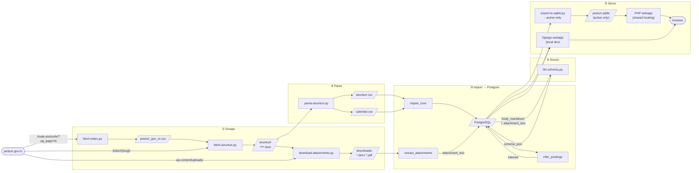

# posturi.gov.ro scraper

Alternative browser / explorer for [posturi.gov.ro](https://posturi.gov.ro). Scrapes the Romanian government job listings portal — and tracks changes over time. Pipeline: index → cache announcement pages → extract structured data → LLM-extracted structured display sections stored in Postgres.

**Site redesigned 2026-07**: The site now runs on WordPress + Astra + Elementor with a custom PG plugin. The pipeline handles both old (`/anunt/{slug}/`) and new (`/joburi/{slug}/`) URL schemes. See `docs/activity-log.md` (2026-08-01) for details.

See [initial specs](https://docs.google.com/document/d/11NXWd4yJII3obPwNsVSJPu7Ue98SqNFQ/) gdocs

## Pipeline



### Quick start — run everything

```bash
python pipeline.py
```

### Selective runs

```bash
python pipeline.py --steps fetch-index,parse,import   # specific steps
python pipeline.py --skip download,infer               # skip slow steps
python pipeline.py --steps infer --provider gemini     # LLM inference only
python pipeline.py --no-llm --force                    # re-run dict-only inference
python pipeline.py --continue-on-error                 # log failures, keep going
```

### Steps

| Step | Script / command | Output |
|------|-----------------|--------|
| `fetch-index` | `fetch-index.py` | `data/posturi_gov_ro.csv` |
| `fetch-detail` | `fetch-anunturi.py` | `data/anunturi/**/*.html` |
| `parse` | `parse-anunturi.py` | `data/anunturi/anunturi.csv` + `data/calendar.csv` |
| `download` | `download-attachments.py` | `data/downloads/` |
| `import` | `manage.py import_csvs` | Postgres `jobs_jobposting` table |
| `extract` | `manage.py extract_attachments` | `JobPosting.attachment_text` |
| `infer` | `manage.py infer_postings` | `JobPosting.inferred` JSONB |
| `schema` | `llm-schema.py` | `JobPosting.schema_json` JSONB |

`--force` re-processes already-done rows for `import`, `extract`, `infer`, and `schema`.
`--limit N` restricts `infer` to N postings (useful for testing).
`--provider gemini|openai|anthropic|deepseek` sets the LLM used by the `infer` and `schema` steps (default: `gemini`).
`--no-llm` skips the LLM portion of `infer` only — the `schema` step is always LLM-driven; use `--skip schema` to omit it.

### LLM Provider Comparison

Compare multiple LLM providers and prompt versions on the same postings without overwriting production results:

```bash
# Run all enabled models (respects enable/disable flags in models_config.json)
python llm-schema.py --compare --limit 10

# Test specific models by regex
python llm-schema.py --compare --model-filter "gemini-.*" --limit 5
python llm-schema.py --compare --model-filter "gpt-.*" --limit 5

# Test different prompt versions (when multiple versions exist in config)
python llm-schema.py --compare --prompt-version v2 --limit 10

# Combine: test GPT models with prompt v2
python llm-schema.py --model-filter "gpt-.*" --prompt-version v2 --limit 3
```

Each variant is stored in `JobPostingSchemaVariant` with:
- Provider, model, prompt version
- Token counts (input/output)
- Cost (USD) calculated from config pricing
- Latency (ms)

**View results:**
- Django admin: `Admin → Schema LLM variants` (filter by provider/model/date)
- Job detail page: click "Dev → Comparație LLM" to see all variants for a posting side-by-side

**Configuration** (`models_config.json`):
- Models: enable/disable flag per model, pricing (including `cache_input_cost_per_million` for cache-hit billing)
- Prompts: versioned prompts (v1, v2, etc.) centralized in config
- `get_enabled_models()` respects `"enabled": true/false` flags

### Prompt v2 (Schema.org-aligned)

The `v2` prompt extracts a flat superset of [Schema.org JobPosting](https://schema.org/JobPosting) properties — keys named after JobPosting properties where they exist (`responsibilities`, `educationRequirements`, `experienceRequirements`, `qualifications`, `skills`, `baseSalary`, `jobBenefits`, `workHours`, `jobLocation`), plus three RO-government-specific custom keys (`application_docs`, `application_fee`, `application_contact`). `baseSalary`, `application_fee`, and `application_contact` are structured dicts; the rest are markdown strings or `null`.

Pydantic models in `schema_models.py` are the single source of truth and feed each provider's native structured-output API:
- **OpenAI**: `response_format={"type":"json_schema","strict":True,...}`
- **Gemini**: `response_schema=JobPostingExtraction`
- **Anthropic**: tool-use with `input_schema`
- **DeepSeek**: `response_format={"type":"json_object"}` (loose) + Pydantic post-validation

A cacheable system prefix (instructions + 2 few-shot examples) is sent on every call so providers can hit their prompt cache — measured ~94–99% input-cache hit rate by the 2nd call on OpenAI/DeepSeek.

### Boilerplate stripping

Before sending to the LLM, `boilerplate.py::strip_hg_1336()` removes generic eligibility lines from HG 1.336/2022 / Codul muncii / OUG 57/2019 art. 542 (cetățenia română, capacitate de muncă, condamnări, pedepse complementare, condițiile generice de studii/vechime etc.). These appear nearly verbatim on every posting and otherwise drown the `qualifications` field with legal citation. The art. 35 dosar list survives intact (it's the `application_docs` content). Measured 13–25% input-length reduction on sampled postings; the bigger win is `qualifications` becoming role-specific signal (76–295 chars) instead of ~2300 chars of legal boilerplate. Toggle off with `python llm-schema.py --no-strip`.

## Data quality

`quality_check.py` samples 5–10 diverse postings and runs all four pipeline layers through automated checks, then writes `data/quality_report.json` and a console summary table.

```bash
# Fast pass — no API calls (CSV fields, attachment extraction, dict-only inference)
webapp/.venv/bin/python3 quality_check.py --no-llm

# Full pass — includes LLM infer fallback + schema.org generation
webapp/.venv/bin/python3 quality_check.py --provider anthropic

# Check specific postings by slug
webapp/.venv/bin/python3 quality_check.py --slugs 2a66f376.doc,67438cc9.docx
```

Use the webapp venv because it has `docx2txt`, `python-docx`, and `pypdf`. PDF OCR fallback requires system tools: `brew install poppler tesseract tesseract-lang` (poppler provides `pdftoppm`; `tesseract-lang` installs `ron` for Romanian). After running, invoke `/quality-review` in Claude Code for a narrative assessment with root-cause analysis and recommended fixes.

## Data

**`data/posturi_gov_ro.csv`** — job index, one row per listing, keyed by URL:

| Field | Description |
|-------|-------------|
| `pozitie` | Job title |
| `url` | Listing URL (primary key) |
| `angajator` | Employer |
| `detalii` | Details (comma-separated tags) |
| `publicat_in` | Publication date |
| `expira_in` | Expiry date |
| `judet` | County |
| `url_judet` | County filter URL |
| `tip` | Listing type |
| `updates` | Semicolon-separated log of field changes with dates |

**`data/anunturi/anunturi.csv`** — one row per cached announcement:

| Field | Description |
|-------|-------------|
| `Job Title` | Position title |
| `Employer` | Hiring organisation |
| `Location` | County / locality |
| `Job Level` | Funcții de execuție / Funcții de conducere |
| `Job Type` | Permanent / Temporar |
| `Employer Category` | Angajator type (Primării, Instituții locale, Guvern și ministere, etc.) |
| `Categorie` | Funcție contractuală / Funcție publică |
| `Announcement URL` | Link to attached document or posting page |
| `Main Body Markdown` | Full announcement text converted to markdown |
| `Other Links` | Comma-separated attachment URLs |
| `Nr Posturi` | Number of vacancies |
| `Contact Telefon` | Phone number extracted from body text |
| `Contact Email` | Email address extracted from body text |
| `Contact Persoana` | Contact person name |
| `Data Limita Depunere` | Application deadline (DD.MM.YYYY, ora HH:MM) |
| `Data Proba Scrisa` | Written test date |
| `Data Interviu` | Interview date |
| `Data Rezultate Finale` | Final results date |

**`data/calendar.csv`** — flat competition timeline table, one row per event:

| Field | Description |
|-------|-------------|
| `url` | Announcement URL |
| `eveniment` | Event description (e.g. "Depunerea dosarelor", "Proba scrisă") |
| `data` | Date in `DD.MM.YYYY` format |
| `ora` | Time in `HH:MM` format (empty if not specified) |

`data/` is gitignored.

## Setup

```bash
pip install -r requirements.txt
```

For LLM scripts and the webapp, copy `.env.example` to `.env` and fill in your API keys.

`dox2md.py` also requires system packages:
```bash
brew install libreoffice pandoc tesseract
```

### Webapp setup

```bash
python3 -m venv .venv
.venv/bin/pip install -r requirements.txt
.venv/bin/python webapp/manage.py migrate
.venv/bin/python webapp/manage.py runserver
```

## PHP webapp (shared hosting)

A lightweight PHP frontend that runs on commodity shared hosting (cPanel). Reads from a read-only SQLite database — no Python, no web server config, just PHP + SQLite.

### Export & deploy

```bash
# Generate active-only SQLite + push to shared host
./deploy-php.sh user@host ~/posturi.gov2.ro

# Or set env vars
DEPLOY_HOST=user@host DEPLOY_PATH=~/posturi.gov2.ro ./deploy-php.sh
```

The deploy script:
1. Runs `export-to-sqlite.py --active-only` — pulls active postings (expires_at >= today) from PostgreSQL into `webapp-php/posturi.sqlite`
2. Rsyncs the entire `webapp-php/` folder to the remote host

The full archive stays in PostgreSQL; the deployed SQLite only contains currently active postings.

### Structure

| Path | Purpose |
|------|---------|
| `index.php` | Front controller — routes `/`, `/job/123/`, `/angajatori/`, `/statistici/`, `/despre/` |
| `db.php` | PDO singleton for `posturi.sqlite` |
| `helpers.php` | Markdown rendering, date formatting, filter builder, facet queries |
| `pages/` | List, detail, employer list, employer detail, stats, about |
| `feeds/` | Atom, JSON API, iCal endpoints |
| `partials/` | Result list partial (HTMX-compatible) |
| `inc/` | Header/footer HTML |
| `.htaccess` | URL rewriting, blocks direct access to `*.sqlite` |

